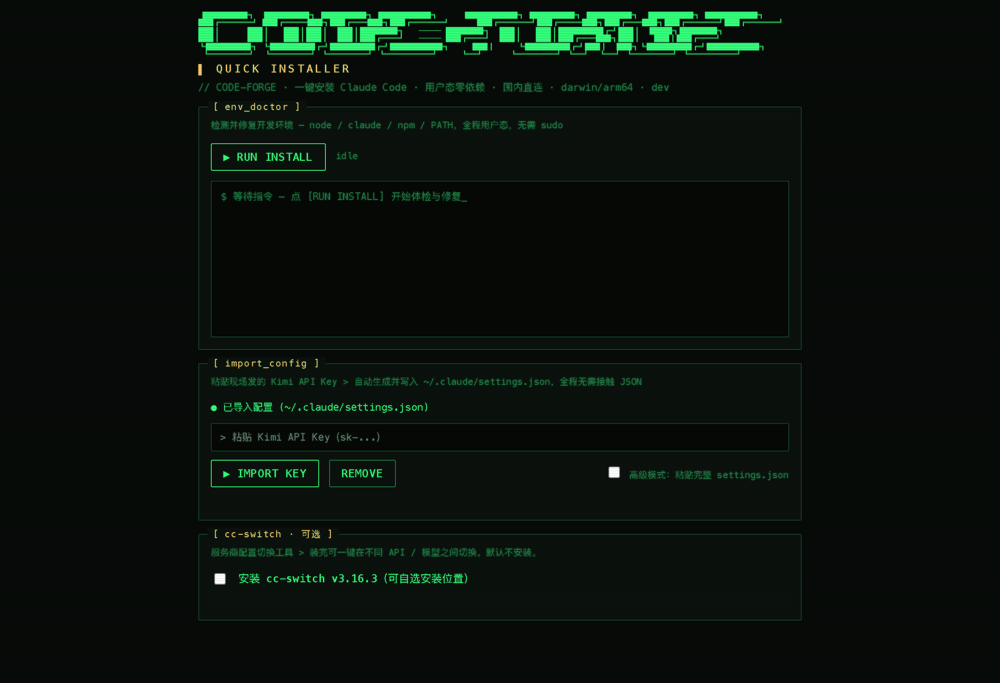

# CODE-FORGE · Claude Code Quick Installer

> 一键安装 Claude Code — 用户态、零依赖、国内直连，无需管理员权限、无需科学上网。
>
> *A zero-dependency, user-space installer for Claude Code, built in Go — mirrors for mainland China, no sudo, no VPN. macOS browser UI + Windows native GUI.*

<p align="center">
  <a href="https://github.com/Alan-Youngzhe/CODE-FORGE_CCQuickInstaller/releases/latest"></a>
  <a href="https://github.com/Alan-Youngzhe/CODE-FORGE_CCQuickInstaller/releases"></a>
  
  
  <a href="LICENSE"></a>
</p>

<p align="center">
  
  <br>
  <sub>macOS 浏览器界面。三块面板：检测并安装 Node.js / Claude Code、粘贴 API Key 生成配置、可选安装 cc-switch。</sub>
</p>

<!-- TODO: Windows GUI 截图 docs/screenshots/gui-windows.png（需在 Windows 上截取） -->

**为什么做这个**：在活动现场帮几十位新手装 Claude Code 时，卡点集中在三处——没有管理员权限、GitHub 和 npm 下载超时、不会改 `settings.json`。这个安装器把三件事都收掉：所有写入落在用户目录，下载全走国内镜像，配置只需粘贴一个 API Key。已发布 10 个版本，20+ 位真实用户在用。
---

## 快速开始

### macOS — 推荐：一行命令（最省事）

打开终端，粘贴以下命令（**国内推荐**，连入口脚本都走加速镜像，全程免梯子）：

```bash
curl -fsSL https://ghfast.top/https://raw.githubusercontent.com/Alan-Youngzhe/CODE-FORGE_CCQuickInstaller/main/install.sh | bash
```

脚本自动下载安装器（同样走镜像）、解除 Gatekeeper 隔离、打开浏览器界面，全程无需手动操作。

> 有梯子或镜像偶发不可用时，可用直连版：
> ```bash
> curl -fsSL https://raw.githubusercontent.com/Alan-Youngzhe/CODE-FORGE_CCQuickInstaller/main/install.sh | bash
> ```

### macOS — 备选：手动下载

前往 [Releases](https://github.com/Alan-Youngzhe/CODE-FORGE_CCQuickInstaller/releases/latest) 下载 `CCQuickInstaller-mac`，然后在终端执行：

```bash
cd ~/Downloads
xattr -dr com.apple.quarantine CCQuickInstaller-mac   # 解除下载隔离，避免被 Gatekeeper 拦截
chmod +x CCQuickInstaller-mac
./CCQuickInstaller-mac
```

> ⚠️ 必须先 `cd ~/Downloads` 进入下载目录，再运行命令。
>
> 🌐 GitHub 下载页国内打不开时，用加速镜像直接下载二进制：
> `https://ghfast.top/https://github.com/Alan-Youngzhe/CODE-FORGE_CCQuickInstaller/releases/latest/download/CCQuickInstaller-mac`

### Windows（双击运行）

下载 [Releases](https://github.com/Alan-Youngzhe/CODE-FORGE_CCQuickInstaller/releases/latest) 中的 `CCQuickInstaller-vX.X.X-win-x64.exe`，双击打开图形界面。

---

## 使用流程

1. 点击 **RUN INSTALL** — 自动检测并安装 Node.js、Claude Code，修复 PATH
2. 在 **import_config** 面板粘贴 Kimi API Key（`sk-` 开头），点 **IMPORT KEY** — 安装器用内置模板自动生成配置，全程无需接触 JSON
3. 打开一个**新终端**，输入 `claude` 开始使用
4.（可选）在 **cc-switch** 面板勾选安装 [cc-switch](https://github.com/farion1231/cc-switch) — 多服务商配置切换工具，装完可一键在不同 API / 模型间切换；默认不安装，安装位置可自选

---

## settings.json 示例（高级模式）

主流程只需粘贴 Kimi API Key。接入其他服务商时，勾选「高级模式」粘贴完整 `settings.json`（以 Kimi K2 为例）：

```json
{
  "env": {
    "ANTHROPIC_BASE_URL": "https://api.moonshot.cn/anthropic",
    "ANTHROPIC_AUTH_TOKEN": "sk-...",
    "ANTHROPIC_MODEL": "kimi-k2-turbo-preview"
  }
}
```

---

## 功能特性

- **全程用户态**：所有写入落在 `~/.local`、`~/.npm-global`、`~/.claude`，不调用 `sudo`
- **国内直连**：Node.js 走 npmmirror，Claude Code 原生二进制走 npmmirror npm 平台包，体积小 3×，速度快 4×
- **幂等**：重复运行自动跳过已就绪项，中途中断再跑也能续完
- **CLI + GUI 两用**：macOS 浏览器界面，Windows 原生 GUI，视觉完全一致
- **可选捆绑 cc-switch**：默认不装；勾选后走 GitHub 国内加速镜像下载，安装位置可自选，与主流程互不影响

---

## 项目结构

```
installer/
├── main.go              # CLI 入口
├── engine/              # 核心逻辑（CLI 与 GUI 共用）
│   ├── doctor.go        # 检查接口 + 三段式执行
│   ├── env.go           # 平台探测 + 镜像地址配置
│   ├── mirror.go        # 下载（断点续传）+ SHA-256 校验
│   ├── config.go        # settings.json 导入/移除
│   ├── ccswitch.go      # 可选：cc-switch 下载安装（国内镜像 + 自选位置）
│   └── check_*.go       # node / claude / npm-prefix / PATH
├── webui/               # macOS 浏览器 UI（HTTP server + SSE）
│   ├── main.go
│   ├── server.go
│   └── static/index.html
└── gui/                 # Windows Wails GUI
    ├── main.go
    ├── app.go
    └── frontend/dist/index.html
```

---

## 构建

**macOS（curl 脚本用的二进制）：**

```bash
cd installer
CGO_ENABLED=0 GOOS=darwin GOARCH=arm64 go build -ldflags="-s -w" -o dist/CCQuickInstaller-arm64 ./webui/
CGO_ENABLED=0 GOOS=darwin GOARCH=amd64 go build -ldflags="-s -w" -o dist/CCQuickInstaller-amd64 ./webui/
lipo -create -output dist/CCQuickInstaller-mac dist/CCQuickInstaller-arm64 dist/CCQuickInstaller-amd64
```

**Windows GUI（需要 [Wails](https://wails.io/)，在 Windows 机器上执行）：**

```bash
cd installer/gui
wails build -platform windows/amd64 -webview2 embed
```

---

## 换镜像源

镜像地址集中在 `engine/env.go`：

| 变量 | 默认值 | 说明 |
|------|--------|------|
| `NodeMirror` | `cdn.npmmirror.com/binaries/node` | Node.js 下载源 |
| `NpmRegistry` | `registry.npmmirror.com` | Claude Code 平台包注册表 |

---

## License

MIT
